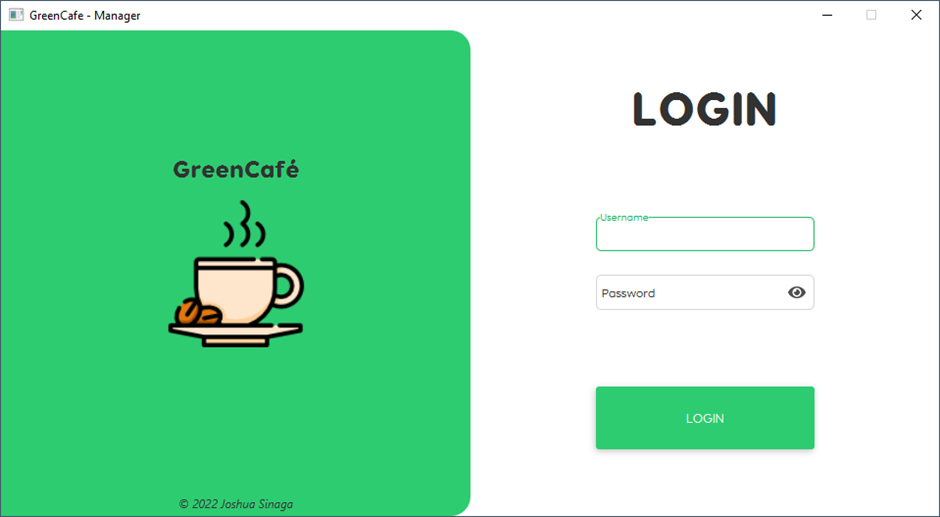

<h1 align="center">GreenCafe</h1>

  

<h5 align="center">cafe cashier app based on JavaFX</h5>

<h1></h1>

<h2>Description</h2>

GreenCafe is a desktop-based cafe cashier application. Manage transactions, reports, menus and users with this app. This application is made to fulfill the Vocational High School Exam project

<h2> Built With </h2>

* JavaFX 11
* Kotlin
  
## License
The software is provided under the MIT License

## Screenshots

For more screenshots, see <a href="screenshots/" target="_blank">screenshots</a>

